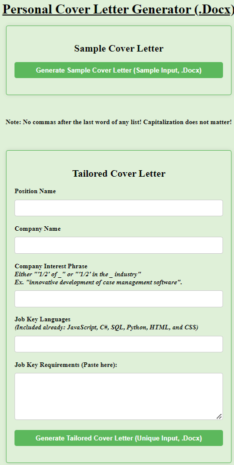

# Personal-Cover-Letter-Generator

### Purpose: 

Automating my process of writing cover letters so I can focus on what I like about each specific company and how I meet their specific requirements. This also ensures that I follow my own guidelines consistently and minimizes human error for the date and company name entry.

### Languages used: 

HTML, CSS, JavaScript (w/ Node.JS) 

### APIs used:

OpenAI

### What is Specifically Addressed?

The date, introduction, conclusion, any repeated company and position name entries and their corresponding prefixes, and the placing of the three body paragraphs (which will be generated as placeholder text in the word document using openAI while following instructions that generally apply to each application which will be further edited and personally re-written) and are then automatically organized.

### How does this save time?

Once I enter the information to the form and submit, I only need to briefly look over and edit the three body paragraphs to ensure that they are consistent with my guidlines and then export to PDF so I can use it for my application while resting assured that all the information was entered and formatted correctly. 

### Live Demo:

This is what the web page looks like. By clicking on either option, I'm able to download a cover letter within seconds. As mentioned, the sample is mainly for testing changes while the tailored option allows me to follow strict guidelines while providing me with a unique cover letter body text to work with as inspiration based on my input.

  

### What Parts are There?

Part 1: The Sample Cover Letter Option

This is a button that uses sample data to generate a Cover Letter (.docx) to test my code.

Part 2: The Tailored Cover Letter Option

This is a form where I submit the position, company name, what I like about the company, and the key job languages and requirements which generates a cover letter (.docx) using this information.

### Quick Set-Up:

- Script to run: npm run start
- Use nodemon by typing "yarn add nodemon"/"npm install -g nodemon" in your console. This will automatically update the console and refresh the application whenever you press "save" with the js code.
- To use parcel bundler: npm install parcel-bundler --save-dev 
- key name for ".env" is OPENAI_API_KEY (template can be copied in the envVarsSample.md file)
- Other issues related to npm packages can be dealt with by using "npm i" to re-install them and making sure that node is updated.